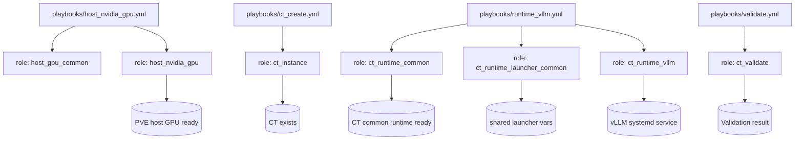

# ktooi.pve_inference

An Ansible Collection for building and operating **CT-based inference environments on Proxmox VE**.

This collection follows these principles:
- Keep **host-side** and **CT-side** responsibilities clearly separated.
- Keep runtime-specific logic isolated per role (`ct_runtime_*`).
- Prefer declarative lifecycle management for repeatability.

---

## Scope

### In scope
- Proxmox host GPU prerequisites.
- CT lifecycle management on PVE.
- Runtime foundation in CT (Python, user, directories).
- Runtime deployment (initially vLLM).
- Post-deployment validation checks.

### Out of scope (initial)
- Kubernetes cluster orchestration.
- VM-first architecture as the primary support path.
- Full multi-node distributed inference orchestration.
- Nested Docker/Podman as primary operational mode.

---

## Support policy (summary)
- **PVE 8.x**: supported
- **PVE 9.x**: beta support
- Initial main path: **NVIDIA + vLLM**
- Designed to expand toward additional vendors/runtimes

See:
- [`docs/support-policy.md`](docs/support-policy.md)
- [`docs/gpu-matrix.md`](docs/gpu-matrix.md)
- [`docs/runtime-matrix.md`](docs/runtime-matrix.md)

---

## Collection and Role relationship



---

## Installation

### Requirements
- Ansible Core `>=2.16`
- `community.proxmox >=1.6.0`

Example `requirements.yml`:

```yaml
collections:
  - name: community.proxmox
    version: ">=1.6.0"
```

Install:

```bash
ansible-galaxy collection install -r requirements.yml
```

---

## Usage

### Supported CT distributions
- Debian: 12, 13
- Ubuntu (LTS): 22.04, 24.04
- RHEL and major RHEL clones: 9, 10 (Red Hat Enterprise Linux, AlmaLinux, Rocky Linux, Oracle Linux)

CT runtime roles load distribution-specific vars files via `tasks/variables.yml` + `vars/*.yml` to handle multi-distribution differences consistently.


### 1) Prepare Proxmox API token (on PVE)

You need an API token with permissions to manage containers on the target node/storage.

Example (adapt for your policy):

```bash
# create automation user
pveum user add ansible@pve --password 'REPLACE_ME'

# create a role with required privileges (example)
pveum role add AnsiblePVE -privs "Sys.Modify VM.Allocate VM.Config.CPU VM.Config.Memory VM.Config.Disk VM.Config.Network VM.Config.Options VM.PowerMgmt Datastore.AllocateSpace Datastore.Audit SDN.Use"

# assign role to user (scope: /)
pveum aclmod / -user ansible@pve -role AnsiblePVE

# create token
pveum user token add ansible@pve ci-token --privsep 0
```

Store the token ID and secret securely (for example in `ansible-vault`).

Example vault workflow:

```bash
# create/edit encrypted vars file
ansible-vault create group_vars/pve_hosts/vault.yml

# or edit existing encrypted file
ansible-vault edit group_vars/pve_hosts/vault.yml

# run playbook with vault prompt
ansible-playbook -i inventory.ini playbooks/ct_create.yml --ask-vault-pass

# (alternative) use a vault password file
ansible-playbook -i inventory.ini playbooks/ct_create.yml --vault-password-file .vault_pass.txt
```

`group_vars/pve_hosts/vault.yml` example:

```yaml
vault_pve_api_token_secret: "REPLACE_WITH_REAL_TOKEN_SECRET"
```

### Troubleshooting: 403 Forbidden (`Permission check failed (/, Sys.Modify)`)

If token authentication succeeds but CT creation fails with:

- `403 Forbidden: Permission check failed (/, Sys.Modify)`

the API user/token is authenticated, but required ACL privileges are missing.

Minimum fix:

- Include `Sys.Modify` in the role privileges used by Ansible.
- Re-apply ACL on `/` for the automation user (or a stricter path that still covers required operations).

Example:

```bash
pveum role modify AnsiblePVE -privs "Sys.Modify VM.Allocate VM.Config.CPU VM.Config.Memory VM.Config.Disk VM.Config.Network VM.Config.Options VM.PowerMgmt Datastore.AllocateSpace Datastore.Audit SDN.Use"
pveum aclmod / -user ansible@pve -role AnsiblePVE
```

Then verify with:

```bash
pveum user permissions ansible@pve
```

### Note: Is `ct_instance_unprivileged: false` required for vLLM?

No. In this collection, vLLM itself does **not** require a privileged CT.
What vLLM needs is GPU visibility inside CT (`/dev/nvidia*`, `libcuda.so.1`, and `torch.cuda` checks).

Operational guidance:

- Prefer `ct_instance_unprivileged: true` when using API tokens/non-root automation users.
- Use `ct_instance_unprivileged: false` only when you explicitly need privileged CT behavior and accept the security/permission trade-offs.

### Troubleshooting: 403 Forbidden (`Permission check failed (/vms/<vmid>, VM.Config.Options)`)

If you see:

- `403 Forbidden: Permission check failed (/vms/<vmid>, VM.Config.Options)`

then the API user/token can access the VM path but cannot modify CT options.
This role sets options such as `onboot`/`unprivileged`, so `VM.Config.Options` is required.

How to resolve:

- Ensure the role used by Ansible includes `VM.Config.Options`.
- Re-apply ACL for the automation user.

Example:

```bash
pveum role modify AnsiblePVE -privs "Sys.Modify VM.Allocate VM.Config.CPU VM.Config.Memory VM.Config.Disk VM.Config.Network VM.Config.Options VM.PowerMgmt Datastore.AllocateSpace Datastore.Audit SDN.Use"
pveum aclmod / -user ansible@pve -role AnsiblePVE
```

### Troubleshooting: 403 Forbidden (`Permission check failed (/sdn/... , SDN.Use)`)

If you see an error like:

- `403 Forbidden: Permission check failed (/sdn/zones/<zone>/<bridge>, SDN.Use)`

then your CT network bridge is managed by Proxmox SDN, and the API user/token lacks `SDN.Use`.

How to resolve:

- Ensure the role used by Ansible includes `SDN.Use`.
- Re-apply ACL to the automation user (for example on `/`), or grant ACL on the relevant SDN subtree according to your policy.

Example:

```bash
pveum role modify AnsiblePVE -privs "Sys.Modify VM.Allocate VM.Config.CPU VM.Config.Memory VM.Config.Disk VM.Config.Network VM.Config.Options VM.PowerMgmt Datastore.AllocateSpace Datastore.Audit SDN.Use"
pveum aclmod / -user ansible@pve -role AnsiblePVE
```

If you do not use SDN bridges, set `ct_instance_netif` to a non-SDN bridge or verify bridge naming/scope.

### Troubleshooting: 403 Forbidden (`changing feature flags for privileged container`)

If you see:

- `403 Forbidden: Permission check failed (changing feature flags for privileged container is only allowed for root@pam)`

this is a Proxmox restriction. For **privileged containers** (`ct_instance_unprivileged: false`), changing feature flags requires `root@pam`.

How to resolve:

- Preferred: set `ct_instance_unprivileged: true` for automation users/tokens.
- Or run with `ct_instance_api_user: root@pam` if your policy allows it.
- Or avoid feature changes on privileged CTs.

Note: this collection automatically omits the `features` parameter for privileged CTs unless `ct_instance_api_user` is `root@pam`.

### Troubleshooting: timeout while creating VM

If you see:

- `Reached timeout while waiting for creating VM`
- and logs include thin-pool warnings such as `You have not turned on protection against thin pools running out of space`

then Proxmox storage task completion is delayed/failing and Ansible timed out waiting.

How to resolve:

- Increase `ct_instance_timeout` (for example `1200`) in `group_vars/pve_hosts.yml`.
- Check thin-pool capacity/health on PVE (`lvs`, free space, metadata usage).
- Configure thin-pool auto-extend/monitoring according to your storage policy.

Example override:

```yaml
ct_instance_timeout: 1200
```

### Troubleshooting: 401 Unauthorized

If you see `401 Unauthorized: Authentication failed!`, check the following:

- `ct_instance_api_user` must be the token owner (example: `ansible@pve`).
- `ct_instance_api_token_id` should be the token name (example: `ci-token`).
  - This collection also accepts legacy `<user>!<token_name>` and normalizes it automatically.
- Ensure ACL is granted to the token owner on the target path (for example `/`).

Quick API test from bastion:

```bash
curl -sk -H "Authorization: PVEAPIToken=ansible@pve!ci-token=REPLACE_WITH_SECRET" \
  https://<PVE_HOST>:8006/api2/json/version
```

A successful response returns version JSON. If this fails with 401, the issue is credentials/ACL on Proxmox side.

### 2) Prepare inventory and vars

`inventory.ini`:

```ini
[pve_hosts]
pve01 ansible_host=192.0.2.10

[ct_targets]
ct-infer-01 ansible_host=198.51.100.20
```

`group_vars/pve_hosts.yml` (example):

```yaml
ct_instance_api_host: "192.0.2.10"
ct_instance_api_user: "ansible@pve"
ct_instance_api_token_id: "ci-token"
ct_instance_api_token_secret: "{{ vault_pve_api_token_secret }}"
ct_instance_node: "pve01"
ct_instance_vmid: 120
ct_instance_hostname: "ct-infer-01"
ct_instance_cores: 16            # CT CPU cores
ct_instance_memory: 131072       # CT memory (MiB)
ct_instance_rootfs_size: 512     # CT rootfs size (GiB)
ct_instance_storage: "local-lvm"
ct_instance_ostemplate: "local:vztmpl/debian-12-standard_12.0-1_amd64.tar.zst"
```

`group_vars/ct_targets.yml` (example):

```yaml
# shared launcher variables (runtime-agnostic)
ct_runtime_launcher_model: "meta-llama/Llama-3.1-8B-Instruct"
ct_runtime_launcher_context_length: 32768   # LLM context size
ct_runtime_launcher_tensor_parallel_size: 4
ct_runtime_launcher_pipeline_parallel_size: 1
ct_runtime_launcher_gpu_memory_utilization: 0.9
ct_runtime_launcher_max_num_seqs: 64
ct_runtime_launcher_max_num_batched_tokens: 8192
ct_runtime_launcher_port: 8000

# runtime-specific variables are still valid
ct_runtime_vllm_dtype: "auto"
ct_runtime_vllm_kv_cache_dtype: "auto"
```

### Frequently tuned variables

These variables often vary by hardware size, model family, and throughput target:
- `ct_instance_cores`, `ct_instance_memory`, `ct_instance_rootfs_size`
- `ct_runtime_launcher_context_length`
- `ct_runtime_launcher_tensor_parallel_size`, `ct_runtime_launcher_pipeline_parallel_size`
- `ct_runtime_launcher_gpu_memory_utilization`
- `ct_runtime_launcher_max_num_seqs`, `ct_runtime_launcher_max_num_batched_tokens`
- `ct_runtime_vllm_dtype`, `ct_runtime_vllm_kv_cache_dtype`

### Preflight checks now included in roles

The collection now performs explicit precondition checks where assumptions were previously implicit, for example:
- Proxmox host side: Debian-family + running `*-pve` kernel + exact `pve-headers-{{ ansible_kernel }}` + NVIDIA device nodes (`/dev/nvidia*`) for `host_nvidia_gpu`
- Proxmox host side: apt install simulation guard to prevent plans that remove `proxmox-ve`
- Proxmox host side: DKMS autoinstall + kernel module variant detection (`nvidia-*` or `nvidia-current-*`) before module load
- CT side: distribution/version support assertions before runtime tasks via `tasks/variables.yml`
- CT vLLM side: default preflight checks for `libcuda.so.1`, `/dev/nvidia*`, and `torch.cuda` availability inside the venv

### 3) Execute playbooks

```bash
ansible-playbook -i inventory.ini playbooks/host_nvidia_gpu.yml
ansible-playbook -i inventory.ini playbooks/ct_create.yml
ansible-playbook -i inventory.ini playbooks/runtime_vllm.yml
ansible-playbook -i inventory.ini playbooks/validate.yml
```

---

## Required variables quick reference (collection-level)

> This table contains variables that are typically **required** for practical execution.
> For complete variable lists, see each role README.

| Variable | Description | Default | Allowed values |
|---|---|---|---|
| `ct_instance_api_host` | Proxmox API endpoint host/IP | `{{ inventory_hostname }}` | Valid hostname/IP |
| `ct_instance_api_user` | Proxmox API user | `root@pam` | Valid PVE API user (e.g. `ansible@pve`) |
| `ct_instance_api_token_id` | API token name (preferred) or legacy `<user>!<token_name>` | `""` | `ci-token` (preferred), or `<user>!<token_name>` |
| `ct_instance_api_token_secret` | API token secret | `""` | Token secret string |
| `ct_instance_node` | Target PVE node | `pve` | Existing node name |
| `ct_instance_vmid` | CT VMID | `100` | Positive integer, unique on cluster |
| `ct_instance_cores` | CT CPU core count | `8` | Integer `>=1` |
| `ct_instance_memory` | CT memory size (MiB) | `32768` | Integer `>=512` |
| `ct_instance_rootfs_size` | CT rootfs size (GiB) | `128` | Integer `>=8` |
| `ct_instance_storage` | Storage for rootfs | `local-lvm` | Existing PVE storage ID |
| `ct_instance_timeout` | Proxmox task wait timeout (seconds) | `600` | Integer `>=30` |
| `ct_instance_ostemplate` | CT OS template | Debian 12 template path | Existing `vztmpl` path |
| `ct_runtime_vllm_model` | Model ID served by vLLM | `mistralai/Mistral-7B-Instruct-v0.3` | Valid Hugging Face/local model identifier |
| `ct_runtime_vllm_tensor_parallel_size` | Tensor parallel size | `1` | Integer `>=1` |
| `ct_runtime_vllm_max_model_len` | LLM context size | `8192` | Integer `>=1` |

Detailed role docs:
- [`roles/host_gpu_common/README.md`](roles/host_gpu_common/README.md)
- [`roles/host_nvidia_gpu/README.md`](roles/host_nvidia_gpu/README.md)
- [`roles/host_amd_gpu/README.md`](roles/host_amd_gpu/README.md)
- [`roles/ct_instance/README.md`](roles/ct_instance/README.md)
- [`roles/ct_runtime_common/README.md`](roles/ct_runtime_common/README.md)
- [`roles/ct_runtime_launcher_common/README.md`](roles/ct_runtime_launcher_common/README.md)
- [`roles/ct_runtime_vllm/README.md`](roles/ct_runtime_vllm/README.md)
- [`roles/ct_runtime_sglang/README.md`](roles/ct_runtime_sglang/README.md)
- [`roles/ct_runtime_tgi/README.md`](roles/ct_runtime_tgi/README.md)
- [`roles/ct_runtime_ollama/README.md`](roles/ct_runtime_ollama/README.md)
- [`roles/ct_validate/README.md`](roles/ct_validate/README.md)

---

## Playbooks

- `playbooks/host_nvidia_gpu.yml`
- `playbooks/host_amd_gpu.yml`
- `playbooks/ct_create.yml`
- `playbooks/runtime_vllm.yml`
- `playbooks/runtime_sglang.yml`
- `playbooks/runtime_tgi.yml`
- `playbooks/runtime_ollama.yml`
- `playbooks/validate.yml`

---

## License

MIT
