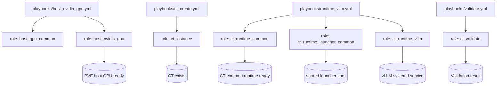

# ktooi.pve_inference

**Proxmox VE 上の CT ベース推論環境**を構築・運用するための Ansible Collection です。

設計原則:
- **ホスト側**と**CT 側**の責務分離
- ランタイム差分を `ct_runtime_*` Role に分離
- 宣言的なライフサイクル管理

---

## スコープ

### 含むもの
- PVE ホストの GPU 前提設定
- CT の作成/更新/削除
- CT 内共通ランタイム基盤（Python、ユーザー、ディレクトリ等）
- 推論ランタイム導入（初期は vLLM）
- 構築後検証

### 初期スコープ外
- Kubernetes クラスタ構築
- VM 主体の運用
- 複数ノード分散推論の本格対応
- Docker/Podman ネスト運用の主対応

---

## サポート方針（要約）
- **PVE 8.x**: 正規サポート
- **PVE 9.x**: ベータサポート
- 初期メイン経路: **NVIDIA + vLLM**
- 将来の GPU ベンダ/ランタイム拡張を前提

詳細:
- [`docs/support-policy.md`](docs/support-policy.md)
- [`docs/gpu-matrix.md`](docs/gpu-matrix.md)
- [`docs/runtime-matrix.md`](docs/runtime-matrix.md)

---

## Collection と Role の関連図



---

## インストール

### 要件
- Ansible Core `>=2.16`
- `community.proxmox >=1.6.0`

`requirements.yml` 例:

```yaml
collections:
  - name: community.proxmox
    version: ">=1.6.0"
```

インストール:

```bash
ansible-galaxy collection install -r requirements.yml
```

---

## 使用方法

### サポート対象 CT ディストリビューション
- Debian: 12, 13
- Ubuntu（LTS）: 22.04, 24.04
- RHEL および主要な RHEL クローン: 9, 10（Red Hat Enterprise Linux / AlmaLinux / Rocky Linux / Oracle Linux）

CT runtime 系 Role は `tasks/variables.yml` と `vars/*.yml` を使ってディストリビューション別変数を読み分ける方式で実装しています。


### 1) PVE で API Token を払い出す

CT 管理には、対象ノード/ストレージに対する十分な権限を持つ API Token が必要です。

例（実運用ポリシーに合わせて調整）:

```bash
# automation 用ユーザー作成
pveum user add ansible@pve --password 'REPLACE_ME'

# 必要権限を持つロール作成（例）
pveum role add AnsiblePVE -privs "Sys.Modify VM.Allocate VM.Config.CPU VM.Config.Memory VM.Config.Disk VM.Config.Network VM.Config.Options VM.PowerMgmt Datastore.AllocateSpace Datastore.Audit SDN.Use"

# ユーザーへロール付与
pveum aclmod / -user ansible@pve -role AnsiblePVE

# トークン作成
pveum user token add ansible@pve ci-token --privsep 0
```

Token ID / Secret は `ansible-vault` 等で安全に管理してください。

`ansible-vault` 利用例:

```bash
# 暗号化された変数ファイルを新規作成
ansible-vault create group_vars/pve_hosts/vault.yml

# 既存の暗号化ファイルを編集
ansible-vault edit group_vars/pve_hosts/vault.yml

# vault パスワード入力で実行
ansible-playbook -i inventory.ini playbooks/ct_create.yml --ask-vault-pass

# （代替）vault パスワードファイル利用
ansible-playbook -i inventory.ini playbooks/ct_create.yml --vault-password-file .vault_pass.txt
```

`group_vars/pve_hosts/vault.yml` 例:

```yaml
vault_pve_api_token_secret: "REPLACE_WITH_REAL_TOKEN_SECRET"
vault_ct_root_password: "REPLACE_WITH_STRONG_PASSWORD"
vault_ct_root_pubkey: "ssh-ed25519 AAAA... your-key-comment"
```

### トラブルシューティング: 403 Forbidden (`Permission check failed (/, Sys.Modify)`)

Token 認証は通るが以下で失敗する場合:

- `403 Forbidden: Permission check failed (/, Sys.Modify)`

API ユーザー/Token の ACL 権限が不足しています。

最小対応:

- Ansible 用ロールに `Sys.Modify` を含める
- 自動化ユーザーに ACL を再付与する（例: `/`）

```bash
pveum role modify AnsiblePVE -privs "Sys.Modify VM.Allocate VM.Config.CPU VM.Config.Memory VM.Config.Disk VM.Config.Network VM.Config.Options VM.PowerMgmt Datastore.AllocateSpace Datastore.Audit SDN.Use"
pveum aclmod / -user ansible@pve -role AnsiblePVE
```

確認:

```bash
pveum user permissions ansible@pve
```

### 補足: `ct_instance_unprivileged: false` は vLLM 必須か?

必須ではありません。vLLM が必要とするのは CT 内での GPU 可視性
（`/dev/nvidia*`、`libcuda.so.1`、`torch.cuda`）です。

運用方針:

- Token / 非 root 自動化なら `ct_instance_unprivileged: true` を推奨
- `ct_instance_unprivileged: false` は必要性が明確な場合のみ利用

### トラブルシューティング: 403 Forbidden (`Permission check failed (/vms/<vmid>, VM.Config.Options)`)

以下で失敗する場合:

- `403 Forbidden: Permission check failed (/vms/<vmid>, VM.Config.Options)`

API ユーザー/Token に CT オプション変更権限がありません。
この Role は `onboot` / `unprivileged` などを設定するため `VM.Config.Options` が必要です。

```bash
pveum role modify AnsiblePVE -privs "Sys.Modify VM.Allocate VM.Config.CPU VM.Config.Memory VM.Config.Disk VM.Config.Network VM.Config.Options VM.PowerMgmt Datastore.AllocateSpace Datastore.Audit SDN.Use"
pveum aclmod / -user ansible@pve -role AnsiblePVE
```

### トラブルシューティング: 403 Forbidden (`Permission check failed (/sdn/... , SDN.Use)`)

以下のようなエラー:

- `403 Forbidden: Permission check failed (/sdn/zones/<zone>/<bridge>, SDN.Use)`

CT ネットワークブリッジが Proxmox SDN 管理で、`SDN.Use` 権限が不足しています。

- ロールに `SDN.Use` を含める
- ACL を再付与（または SDN サブツリーへポリシーに沿って付与）

```bash
pveum role modify AnsiblePVE -privs "Sys.Modify VM.Allocate VM.Config.CPU VM.Config.Memory VM.Config.Disk VM.Config.Network VM.Config.Options VM.PowerMgmt Datastore.AllocateSpace Datastore.Audit SDN.Use"
pveum aclmod / -user ansible@pve -role AnsiblePVE
```

SDN を使わない場合は、`ct_instance_netif` を非 SDN ブリッジへ変更してください。

### トラブルシューティング: 403 Forbidden (`changing feature flags for privileged container`)

以下で失敗する場合:

- `403 Forbidden: Permission check failed (changing feature flags for privileged container is only allowed for root@pam)`

Proxmox の制約です。**privileged CT**（`ct_instance_unprivileged: false`）で feature 変更は `root@pam` のみ許可されます。

対応:

- 推奨: `ct_instance_unprivileged: true` にする
- または `ct_instance_api_user: root@pam` で実行（許容される場合）
- あるいは privileged CT では feature 変更を行わない

注: 本 Collection は privileged CT かつ `root@pam` 以外の場合、`features` パラメータを自動で省略します。

### トラブルシューティング: VM 作成待機で timeout

以下が出る場合:

- `Reached timeout while waiting for creating VM`
- かつ thin-pool 警告（例: `You have not turned on protection against thin pools running out of space`）

Proxmox のストレージ処理が遅延/失敗しており、Ansible 側待機時間を超えています。

対応:

- `group_vars/pve_hosts.yml` で `ct_instance_timeout` を増やす（例: `1200`）
- PVE 側で thin-pool 容量/メタデータ使用率を確認（`lvs` など）
- thin-pool の auto-extend / 監視設定を見直す

```yaml
ct_instance_timeout: 1200
```

### トラブルシューティング: 401 Unauthorized

`401 Unauthorized: Authentication failed!` の場合:

- `ct_instance_api_user` は Token 所有者（例: `ansible@pve`）に一致させる
- `ct_instance_api_token_id` は Token 名（例: `ci-token`）を推奨
  - 本 Collection は従来形式 `<user>!<token_name>` も自動正規化で受け付けます
- ACL が対象パス（例: `/`）に付与されているか確認

簡易 API テスト:

```bash
curl -sk -H "Authorization: PVEAPIToken=ansible@pve!ci-token=REPLACE_WITH_SECRET" \
  https://<PVE_HOST>:8006/api2/json/version
```

### 2) Inventory / 変数を準備

`inventory.ini`:

```ini
[pve_hosts]
pve01 ansible_host=192.0.2.10

[ct_targets]
ct-infer-01 ansible_host=198.51.100.20
```

`group_vars/pve_hosts.yml` 例:

```yaml
ct_instance_api_host: "192.0.2.10"
ct_instance_api_user: "ansible@pve"
ct_instance_api_token_id: "ci-token"
ct_instance_api_token_secret: "{{ vault_pve_api_token_secret }}"
ct_instance_validate_certs: false
ct_instance_password: "{{ vault_ct_root_password }}"
ct_instance_pubkey: "{{ vault_ct_root_pubkey }}"
ct_instance_node: "pve01"
ct_instance_vmid: 120
ct_instance_hostname: "ct-infer-01"
ct_instance_cores: 16            # CT の CPU コア数
ct_instance_memory: 131072       # CT のメモリサイズ (MiB)
ct_instance_rootfs_size: 512     # CT のディスクサイズ (GiB)
ct_instance_storage: "local-lvm"
ct_instance_ostemplate: "local:vztmpl/debian-12-standard_12.0-1_amd64.tar.zst"
ct_instance_enable_nvidia_passthrough: true
```

`group_vars/ct_targets.yml` 例:

```yaml
# CT 作成後に接続するための設定
ansible_user: "root"
# 認証方式はどちらか一方を使用
# ansible_password: "{{ vault_ct_root_password }}"
ansible_ssh_private_key_file: "~/.ssh/id_ed25519"

# ランタイム共通のランチャー変数
ct_runtime_launcher_model: "meta-llama/Llama-3.1-8B-Instruct"
ct_runtime_launcher_context_length: 32768   # LLM のコンテキスト長
ct_runtime_launcher_tensor_parallel_size: 4
ct_runtime_launcher_pipeline_parallel_size: 1
ct_runtime_launcher_gpu_memory_utilization: 0.9
ct_runtime_launcher_max_num_seqs: 64
ct_runtime_launcher_max_num_batched_tokens: 8192
ct_runtime_launcher_port: 8000

# ランタイム固有変数も引き続き指定可能
ct_runtime_vllm_dtype: "auto"
ct_runtime_vllm_kv_cache_dtype: "auto"
```

### 調整頻度が高い変数

ハードウェア構成やモデル特性に応じて、次の変数は調整頻度が高くなります。
- `ct_instance_cores`, `ct_instance_memory`, `ct_instance_rootfs_size`
- `ct_runtime_launcher_context_length`
- `ct_runtime_launcher_tensor_parallel_size`, `ct_runtime_launcher_pipeline_parallel_size`
- `ct_runtime_launcher_gpu_memory_utilization`
- `ct_runtime_launcher_max_num_seqs`, `ct_runtime_launcher_max_num_batched_tokens`
- `ct_runtime_vllm_dtype`, `ct_runtime_vllm_kv_cache_dtype`

### Role による前提条件チェック

これまで暗黙だった前提条件について、Role 内で明示チェックするようにしました。例えば:
- PVE ホスト側: `host_nvidia_gpu` で Debian 系 / `*-pve` カーネル / `pve-headers-{{ ansible_kernel }}` / `/dev/nvidia*` を確認
- PVE ホスト側: `proxmox-ve` が削除される apt プランを検知した場合は中断
- PVE ホスト側: DKMS 自動ビルド後、`nvidia-*` / `nvidia-current-*` のどちらのモジュール名か判定してロード
- CT 側: `tasks/variables.yml` でディストリビューションとバージョンのサポート可否を先に検証
- CT の vLLM 側: `libcuda.so.1` / `/dev/nvidia*` / venv 内 `torch.cuda` の事前チェックをデフォルトで実施

### 2.5) 後続 Playbook のための CT ログイン設定

`ct_create.yml` 後、runtime/validate Playbook は `ct_targets` へ SSH 接続します。
`group_vars/ct_targets.yml` に少なくとも次のいずれかを設定してください。

- 鍵認証: `ansible_user` + `ansible_ssh_private_key_file`
- パスワード認証: `ansible_user` + `ansible_password`

`ct_instance_password` と `ct_instance_pubkey` を両方設定した場合、どちらの認証方式も利用できます。

### トラブルシューティング: `CT <vmid> already exists on node`

`ct_create.yml` で `CT <vmid> already exists` が出る場合、再実行時の冪等性が崩れています。
本 Collection は CT 存在確認を行い、再実行時には作成専用項目（`ostemplate`、初期 `password`/`pubkey`）を省略するよう改善しました。

継続して失敗する場合は次を確認してください。

- `ct_instance_vmid` が意図した既存 CT と一致しているか
- 実行環境の Role が最新版か

### トラブルシューティング: CT 内で /dev/nvidia* が見えない

`runtime_vllm` で `/dev/nvidia* missing` が出る場合、CT 側のデバイスパススルー設定が不足しています。

本 Collection では次を推奨します。

```yaml
ct_instance_enable_nvidia_passthrough: true
```

その後 `playbooks/ct_create.yml` を再実行してください。
パススルーブロックが変更された場合は、`ct_instance_restart_on_nvidia_passthrough_change: true` で CT を自動再起動できます。

### トラブルシューティング: runtime Playbook で apt 404

`ct_runtime_common` のパッケージインストールで Debian の `404 Not Found` が出る場合、CT の apt キャッシュが古い可能性が高いです。
本 Collection はインストール前に apt キャッシュを更新し、失敗時は強制更新して 1 回リトライします。

必要に応じて以下を `group_vars/ct_targets.yml` に設定してください。

```yaml
ct_runtime_common_apt_cache_valid_time: 0
```

毎回 apt キャッシュを更新する動作になります。

### 3) Playbook 実行

```bash
ansible-playbook -i inventory.ini playbooks/host_nvidia_gpu.yml
ansible-playbook -i inventory.ini playbooks/ct_create.yml
ansible-playbook -i inventory.ini playbooks/runtime_vllm.yml
ansible-playbook -i inventory.ini playbooks/validate.yml
```

---

## 必須変数クイックリファレンス（Collection 全体）

> 実運用で指定がほぼ必須となる変数を掲載しています。  
> 全変数は各 Role README を参照してください。

| 変数名 | 概要 | デフォルト値 | 指定可能な値 |
|---|---|---|---|
| `ct_instance_api_host` | Proxmox API ホスト/IP | `{{ inventory_hostname }}` | 有効なホスト名/IP |
| `ct_instance_api_user` | Proxmox API ユーザー | `root@pam` | 有効な PVE API ユーザー |
| `ct_instance_api_token_id` | API Token 名（推奨）または従来形式 `<user>!<token_name>` | `""` | `ci-token`（推奨）または `<user>!<token_name>` |
| `ct_instance_api_token_secret` | API Token Secret | `""` | Token secret 文字列 |
| `ct_instance_validate_certs` | Proxmox API HTTPS 証明書を検証するか | `false` | `true` / `false` |
| `ct_instance_password` | CT root 初期パスワード（任意） | `""` | 空でない文字列（vault 推奨） |
| `ct_instance_pubkey` | CT root 初期公開鍵（任意） | `""` | SSH 公開鍵 1 行 |
| `ct_instance_node` | CT 作成対象ノード | `pve` | 既存ノード名 |
| `ct_instance_vmid` | CT VMID | `100` | 正の整数（クラスタ内一意） |
| `ct_instance_cores` | CT の CPU コア数 | `8` | `1` 以上の整数 |
| `ct_instance_memory` | CT のメモリサイズ (MiB) | `32768` | `512` 以上の整数 |
| `ct_instance_rootfs_size` | CT のディスクサイズ (GiB) | `128` | `8` 以上の整数 |
| `ct_instance_storage` | rootfs 配置ストレージ | `local-lvm` | 既存ストレージ ID |
| `ct_instance_timeout` | Proxmox タスク待機タイムアウト（秒） | `600` | `30` 以上の整数 |
| `ct_instance_enable_nvidia_passthrough` | CT 設定へ NVIDIA パススルーブロックを管理 | `false` | `true` / `false` |
| `ct_instance_ostemplate` | CT OS テンプレート | Debian 12 template path | 既存 `vztmpl` パス |
| `ct_runtime_vllm_model` | vLLM 配信モデル ID | `mistralai/Mistral-7B-Instruct-v0.3` | 有効な HF/ローカルモデル識別子 |
| `ct_runtime_vllm_tensor_parallel_size` | Tensor Parallel 数 | `1` | `1` 以上の整数 |
| `ct_runtime_vllm_max_model_len` | LLM コンテキスト長 | `8192` | `1` 以上の整数 |

Role 詳細:
- [`roles/host_gpu_common/README.md`](roles/host_gpu_common/README.md)
- [`roles/host_nvidia_gpu/README.md`](roles/host_nvidia_gpu/README.md)
- [`roles/host_amd_gpu/README.md`](roles/host_amd_gpu/README.md)
- [`roles/ct_instance/README.md`](roles/ct_instance/README.md)
- [`roles/ct_runtime_common/README.md`](roles/ct_runtime_common/README.md)
- [`roles/ct_runtime_launcher_common/README.md`](roles/ct_runtime_launcher_common/README.md)
- [`roles/ct_runtime_vllm/README.md`](roles/ct_runtime_vllm/README.md)
- [`roles/ct_runtime_sglang/README.md`](roles/ct_runtime_sglang/README.md)
- [`roles/ct_runtime_tgi/README.md`](roles/ct_runtime_tgi/README.md)
- [`roles/ct_runtime_ollama/README.md`](roles/ct_runtime_ollama/README.md)
- [`roles/ct_validate/README.md`](roles/ct_validate/README.md)

---

## Playbook 一覧

- `playbooks/host_nvidia_gpu.yml`
- `playbooks/host_amd_gpu.yml`
- `playbooks/ct_create.yml`
- `playbooks/runtime_vllm.yml`
- `playbooks/runtime_sglang.yml`
- `playbooks/runtime_tgi.yml`
- `playbooks/runtime_ollama.yml`
- `playbooks/validate.yml`

---

## ライセンス

MIT
