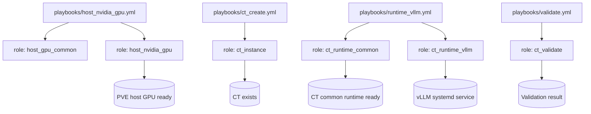

# ktooi.pve_inference

**Proxmox VE 上の CT ベース推論環境**を構築・運用するための Ansible Collection です。

設計原則:
- **ホスト側**と**CT 側**の責務分離
- ランタイム差分を `ct_runtime_*` Role に分離
- 宣言的なライフサイクル管理

---

## スコープ

### 含むもの
- PVE ホストの GPU 前提設定
- CT の作成/更新/削除
- CT 内共通ランタイム基盤（Python、ユーザー、ディレクトリ等）
- 推論ランタイム導入（初期は vLLM）
- 構築後検証

### 初期スコープ外
- Kubernetes クラスタ構築
- VM 主体の運用
- 複数ノード分散推論の本格対応
- Docker/Podman ネスト運用の主対応

---

## サポート方針（要約）
- **PVE 8.x**: 正規サポート
- **PVE 9.x**: ベータサポート
- 初期メイン経路: **NVIDIA + vLLM**
- 将来の GPU ベンダ/ランタイム拡張を前提

詳細:
- [`docs/support-policy.md`](docs/support-policy.md)
- [`docs/gpu-matrix.md`](docs/gpu-matrix.md)
- [`docs/runtime-matrix.md`](docs/runtime-matrix.md)

---

## Collection と Role の関連図（Mermaid）



---

## インストール

### 要件
- Ansible Core `>=2.16`
- `community.proxmox >=1.6.0`

`requirements.yml` 例:

```yaml
collections:
  - name: community.proxmox
    version: ">=1.6.0"
```

インストール:

```bash
ansible-galaxy collection install -r requirements.yml
```

---

## 使用方法

### 1) PVE で API Token を払い出す

CT 管理には、対象ノード/ストレージに対する十分な権限を持つ API Token が必要です。

例（実運用ポリシーに合わせて調整）:

```bash
# automation 用ユーザー作成
pveum user add ansible@pve --password 'REPLACE_ME'

# 必要権限を持つロール作成（例）
pveum role add AnsiblePVE -privs "VM.Allocate VM.Config.CPU VM.Config.Memory VM.Config.Disk VM.Config.Network VM.PowerMgmt Datastore.AllocateSpace Datastore.Audit"

# ユーザーへロール付与
pveum aclmod / -user ansible@pve -role AnsiblePVE

# トークン作成
pveum user token add ansible@pve ci-token --privsep 0
```

Token ID / Secret は `ansible-vault` 等で安全に管理してください。

`ansible-vault` 利用例:

```bash
# 暗号化された変数ファイルを新規作成
ansible-vault create group_vars/pve_hosts/vault.yml

# 既存の暗号化ファイルを編集
ansible-vault edit group_vars/pve_hosts/vault.yml

# vault パスワード入力で実行
ansible-playbook -i inventory.ini playbooks/ct_create.yml --ask-vault-pass

# （代替）vault パスワードファイル利用
ansible-playbook -i inventory.ini playbooks/ct_create.yml --vault-password-file .vault_pass.txt
```

`group_vars/pve_hosts/vault.yml` 例:

```yaml
vault_pve_api_token_secret: "REPLACE_WITH_REAL_TOKEN_SECRET"
```

### 2) Inventory / 変数を準備

`inventory.ini`:

```ini
[pve_hosts]
pve01 ansible_host=192.0.2.10

[ct_targets]
ct-infer-01 ansible_host=198.51.100.20
```

`group_vars/pve_hosts.yml` 例:

```yaml
ct_instance_api_host: "192.0.2.10"
ct_instance_api_user: "ansible@pve"
ct_instance_api_token_id: "ansible@pve!ci-token"
ct_instance_api_token_secret: "{{ vault_pve_api_token_secret }}"
ct_instance_node: "pve01"
ct_instance_vmid: 120
ct_instance_hostname: "ct-infer-01"
ct_instance_storage: "local-lvm"
ct_instance_ostemplate: "local:vztmpl/debian-12-standard_12.0-1_amd64.tar.zst"
```

`group_vars/ct_targets.yml` 例:

```yaml
ct_runtime_vllm_model: "meta-llama/Llama-3.1-8B-Instruct"
ct_runtime_vllm_tensor_parallel_size: 4
ct_runtime_vllm_port: 8000
```

### 3) Playbook 実行

```bash
ansible-playbook -i inventory.ini playbooks/host_nvidia_gpu.yml
ansible-playbook -i inventory.ini playbooks/ct_create.yml
ansible-playbook -i inventory.ini playbooks/runtime_vllm.yml
ansible-playbook -i inventory.ini playbooks/validate.yml
```

---

## 必須変数クイックリファレンス（Collection 全体）

> 実運用で指定がほぼ必須となる変数を掲載しています。  
> 全変数は各 Role README を参照してください。

| 変数名 | 概要 | デフォルト値 | 指定可能な値 |
|---|---|---|---|
| `ct_instance_api_host` | Proxmox API ホスト/IP | `{{ inventory_hostname }}` | 有効なホスト名/IP |
| `ct_instance_api_user` | Proxmox API ユーザー | `root@pam` | 有効な PVE API ユーザー |
| `ct_instance_api_token_id` | API Token ID | `""` | `<user>!<token_name>` |
| `ct_instance_api_token_secret` | API Token Secret | `""` | Token secret 文字列 |
| `ct_instance_node` | CT 作成対象ノード | `pve` | 既存ノード名 |
| `ct_instance_vmid` | CT VMID | `100` | 正の整数（クラスタ内一意） |
| `ct_instance_storage` | rootfs 配置ストレージ | `local-lvm` | 既存ストレージ ID |
| `ct_instance_ostemplate` | CT OS テンプレート | Debian 12 template path | 既存 `vztmpl` パス |
| `ct_runtime_vllm_model` | vLLM 配信モデル ID | `mistralai/Mistral-7B-Instruct-v0.3` | 有効な HF/ローカルモデル識別子 |
| `ct_runtime_vllm_tensor_parallel_size` | Tensor Parallel 数 | `1` | `1` 以上の整数 |

Role 詳細:
- [`roles/host_gpu_common/README.md`](roles/host_gpu_common/README.md)
- [`roles/host_nvidia_gpu/README.md`](roles/host_nvidia_gpu/README.md)
- [`roles/host_amd_gpu/README.md`](roles/host_amd_gpu/README.md)
- [`roles/ct_instance/README.md`](roles/ct_instance/README.md)
- [`roles/ct_runtime_common/README.md`](roles/ct_runtime_common/README.md)
- [`roles/ct_runtime_vllm/README.md`](roles/ct_runtime_vllm/README.md)
- [`roles/ct_runtime_sglang/README.md`](roles/ct_runtime_sglang/README.md)
- [`roles/ct_runtime_tgi/README.md`](roles/ct_runtime_tgi/README.md)
- [`roles/ct_runtime_ollama/README.md`](roles/ct_runtime_ollama/README.md)
- [`roles/ct_validate/README.md`](roles/ct_validate/README.md)

---

## Playbook 一覧

- `playbooks/host_nvidia_gpu.yml`
- `playbooks/host_amd_gpu.yml`
- `playbooks/ct_create.yml`
- `playbooks/runtime_vllm.yml`
- `playbooks/runtime_sglang.yml`
- `playbooks/runtime_tgi.yml`
- `playbooks/runtime_ollama.yml`
- `playbooks/validate.yml`

---

## ライセンス

MIT
