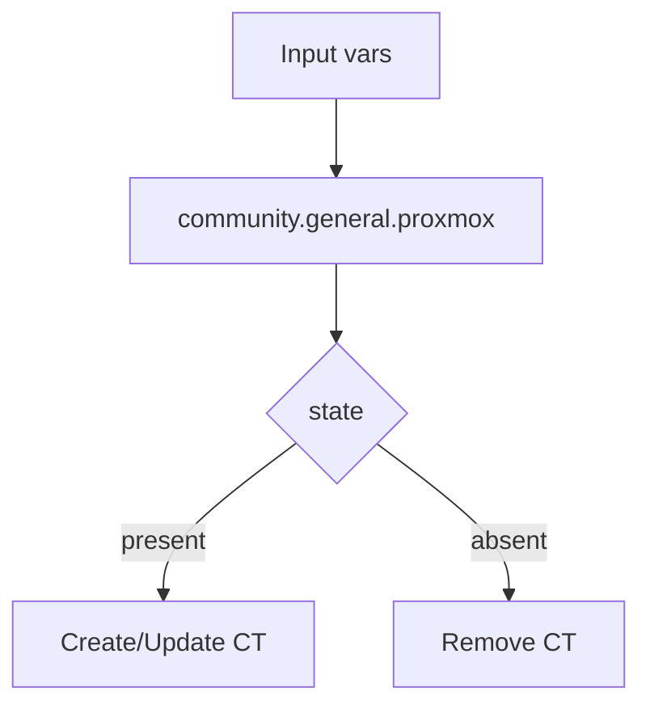

# Role: ct_instance

## Purpose
Declaratively manage Proxmox CT lifecycle (create/update/delete).

## Usage
```yaml
- hosts: pve_hosts
  gather_facts: false
  roles:
    - role: ktooi.pve_inference.ct_instance
```

## Flow


## Variables

| Variable | Description | Default | Allowed values |
|---|---|---|---|
| `ct_instance_api_host` | Proxmox API host/IP | `{{ inventory_hostname }}` | Valid hostname/IP |
| `ct_instance_api_user` | Proxmox API user | `root@pam` | Valid PVE API user |
| `ct_instance_api_token_id` | API token name (preferred) or legacy `<user>!<token_name>` | `""` | `ci-token` (preferred), or `<user>!<token_name>` |
| `ct_instance_api_token_secret` | API token secret | `""` | Token secret string |
| `ct_instance_node` | Target node name | `pve` | Existing node name |
| `ct_instance_storage` | Storage ID for CT root disk (`disk` parameter) | `local-lvm` | Existing storage ID |
| `ct_instance_ostemplate` | CT template path | `local:vztmpl/debian-12-standard_12.0-1_amd64.tar.zst` | Existing template path |
| `ct_instance_vmid` | CT VMID | `100` | Positive integer |
| `ct_instance_hostname` | CT hostname | `ct-infer` | Valid hostname |
| `ct_instance_cores` | vCPU cores | `8` | Integer `>=1` |
| `ct_instance_memory` | Memory (MiB) | `32768` | Integer `>=512` |
| `ct_instance_swap` | Swap (MiB) | `8192` | Integer `>=0` |
| `ct_instance_rootfs_size` | Root disk size (GiB logical; passed as `disk: <storage>:<size>`) | `128` | Integer `>=8` |
| `ct_instance_netif` | CT network map | `{'net0':'name=eth0,bridge=vmbr0,ip=dhcp'}` | Proxmox netif map |
| `ct_instance_onboot` | Start on host boot | `true` | `true` / `false` |
| `ct_instance_unprivileged` | Unprivileged CT mode | `false` | `true` / `false` |
| `ct_instance_features` | Proxmox CT features (`map` or `list`) (applied only for unprivileged CT, or when `ct_instance_api_user` is `root@pam`) | `{'nesting': 0}` | Feature map (`{nesting: 1}`) or list (`['nesting=1']`) |
| `ct_instance_mounts` | Mount points map | `{}` | Proxmox mounts map |
| `ct_instance_timeout` | Proxmox task wait timeout (seconds) | `600` | Integer `>=30` |
| `ct_instance_state` | Desired CT state | `present` | `present` / `absent` / module-supported states |


## Note on vLLM and privileged mode
`ct_instance_unprivileged: false` is **not** a hard requirement for vLLM.
In this collection, vLLM readiness is validated by GPU visibility checks inside CT (for example `/dev/nvidia*`, `libcuda.so.1`, and `torch.cuda`), not by privileged mode itself.
