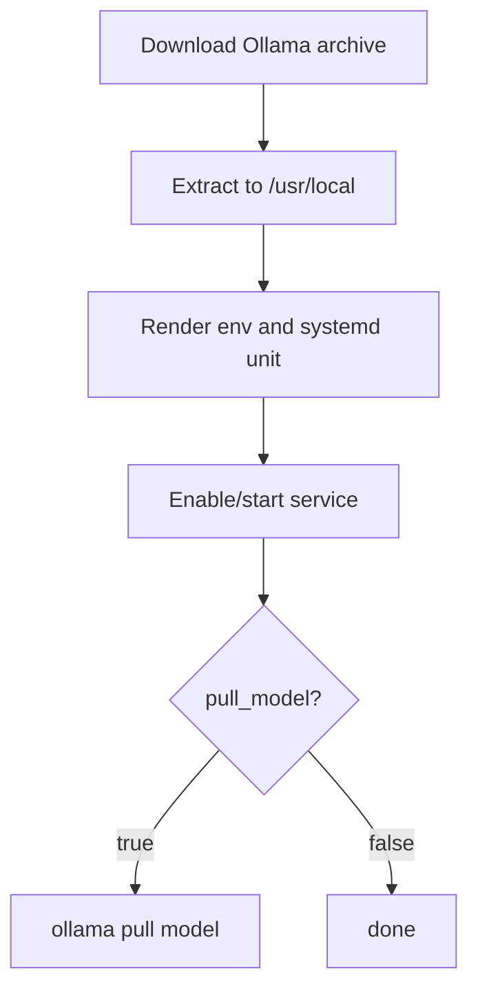

# Role: ct_runtime_ollama

## Purpose
Install and run Ollama directly inside CT as a systemd-managed service.

Supported CT distributions: Debian 12/13, Ubuntu 22.04/24.04 LTS, and RHEL/AlmaLinux/Rocky/Oracle Linux 9/10.

## Usage
```yaml
- hosts: ct_targets
  become: true
  roles:
    - role: ktooi.pve_inference.ct_runtime_common
    - role: ktooi.pve_inference.ct_runtime_launcher_common
    - role: ktooi.pve_inference.ct_runtime_ollama
```

## Flow


## Variables

| Variable | Description | Default | Allowed values |
|---|---|---|---|
| `ct_runtime_ollama_user` | Service user | `infer` | Existing Linux username |
| `ct_runtime_ollama_group` | Service group | `infer` | Existing Linux group |
| `ct_runtime_ollama_workdir` | Working directory | `/opt/inference` | Absolute path |
| `ct_runtime_ollama_env_file` | Environment file path | `/etc/default/ollama` | Absolute path |
| `ct_runtime_ollama_service_name` | systemd unit name | `ollama.service` | Valid unit name |
| `ct_runtime_ollama_bind_host` | API bind host | `{{ ct_runtime_launcher_bind_host | default('0.0.0.0') }}` | IP/host string |
| `ct_runtime_ollama_port` | API port | `{{ ct_runtime_launcher_port | default(11434) }}` | Integer `1..65535` |
| `ct_runtime_ollama_model` | Model name to pull (optional) | `{{ ct_runtime_launcher_model | default('', true) }}` | Empty or model name |
| `ct_runtime_ollama_serve_models_path` | Models directory | `/var/lib/ollama` | Absolute path |
| `ct_runtime_ollama_binary_url` | Download URL for Ollama archive | `https://github.com/ollama/ollama/releases/download/v0.6.8/ollama-linux-amd64.tgz` | Valid URL |
| `ct_runtime_ollama_binary_archive` | Download destination file | `/tmp/ollama-linux-amd64.tgz` | Absolute path |
| `ct_runtime_ollama_binary_dest_dir` | Archive extract destination | `/usr/local` | Absolute path |
| `ct_runtime_ollama_extra_args` | Extra `ollama serve` args | `{{ ct_runtime_launcher_extra_args | default('') }}` | String |
| `ct_runtime_ollama_pull_model` | Pull model after service start | `false` | `true` / `false` |
