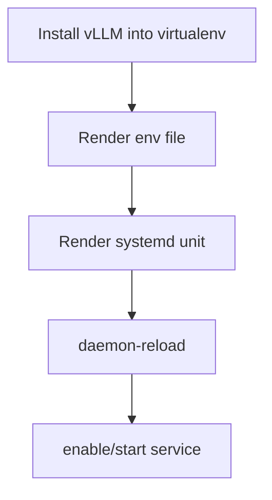

# Role: ct_runtime_vllm

## Purpose
Install/configure vLLM inside CT and manage it with systemd.

## Usage
```yaml
- hosts: ct_targets
  become: true
  roles:
    - role: ktooi.pve_inference.ct_runtime_common
    - role: ktooi.pve_inference.ct_runtime_vllm
```

## Flow (Mermaid)


## Variables

| Variable | Description | Default | Allowed values |
|---|---|---|---|
| `ct_runtime_vllm_user` | Service user | `infer` | Existing Linux username |
| `ct_runtime_vllm_group` | Service group | `infer` | Existing Linux group |
| `ct_runtime_vllm_venv` | venv path containing `vllm` | `/opt/inference/venv` | Absolute path |
| `ct_runtime_vllm_workdir` | systemd WorkingDirectory | `/opt/inference` | Absolute path |
| `ct_runtime_vllm_env_file` | Environment file path | `/etc/default/vllm` | Absolute path |
| `ct_runtime_vllm_service_name` | systemd service unit name | `vllm.service` | Valid unit name |
| `ct_runtime_vllm_bind_host` | API bind host | `0.0.0.0` | IP/host string |
| `ct_runtime_vllm_port` | API port | `8000` | Integer `1..65535` |
| `ct_runtime_vllm_model` | Model identifier | `mistralai/Mistral-7B-Instruct-v0.3` | Valid model identifier |
| `ct_runtime_vllm_tensor_parallel_size` | Tensor parallel size | `1` | Integer `>=1` |
| `ct_runtime_vllm_max_model_len` | Max model context length | `8192` | Integer `>=1` |
| `ct_runtime_vllm_gpu_memory_utilization` | GPU memory utilization ratio | `0.9` | Float `0.1..1.0` |
| `ct_runtime_vllm_extra_args` | Extra CLI args | `""` | String |
| `ct_runtime_vllm_version` | Pin version (optional) | `""` | Empty or semantic version string |
