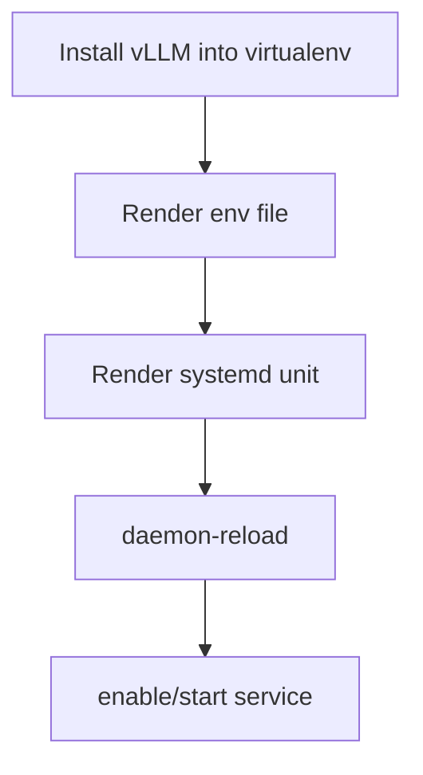

# Role: ct_runtime_vllm

## Purpose
Install/configure vLLM inside CT and manage it with systemd.

Supported CT distributions: Debian 12/13, Ubuntu 22.04/24.04 LTS, and RHEL/AlmaLinux/Rocky/Oracle Linux 9/10.

This role can consume shared values from `ct_runtime_launcher_common`, while runtime-specific variables (for example `ct_runtime_vllm_model`) continue to work as before.

## Usage
```yaml
- hosts: ct_targets
  become: true
  roles:
    - role: ktooi.pve_inference.ct_runtime_common
    - role: ktooi.pve_inference.ct_runtime_vllm
```

### Tuning example
```yaml
ct_runtime_vllm_model: "Qwen/Qwen3.5-27B"
ct_runtime_vllm_tensor_parallel_size: 4
ct_runtime_vllm_pipeline_parallel_size: 1
ct_runtime_vllm_gpu_memory_utilization: 0.88
ct_runtime_vllm_dtype: "auto"
ct_runtime_vllm_kv_cache_dtype: "auto"
ct_runtime_vllm_max_model_len: 262144
ct_runtime_vllm_max_num_seqs: 128
ct_runtime_vllm_max_num_batched_tokens: 8192
ct_runtime_vllm_tool_call_parser: "qwen3_coder"
ct_runtime_vllm_reasoning_parser: "qwen3"
ct_runtime_vllm_served_model_name: "qwen3.5"
ct_runtime_vllm_nccl_p2p_disable: 0
ct_runtime_vllm_nccl_ib_disable: 0
ct_runtime_vllm_nccl_p2p_level: 5
ct_runtime_vllm_nccl_debug: "INFO"
ct_runtime_vllm_nccl_ignore_disabled_p2p: 1
ct_runtime_vllm_ld_library_path: "/usr/local/nvidia/lib64:/usr/local/nvidia/lib:/usr/lib/x86_64-linux-gnu"
```

## Flow


## Variables

| Variable | Description | Default | Allowed values |
|---|---|---|---|
| `ct_runtime_vllm_user` | Service user | `infer` | Existing Linux username |
| `ct_runtime_vllm_group` | Service group | `infer` | Existing Linux group |
| `ct_runtime_vllm_venv` | venv path containing `vllm` | `/opt/inference/venv` | Absolute path |
| `ct_runtime_vllm_workdir` | systemd WorkingDirectory | `/opt/inference` | Absolute path |
| `ct_runtime_vllm_env_file` | Environment file path | `/etc/default/vllm` | Absolute path |
| `ct_runtime_vllm_service_name` | systemd service unit name | `vllm.service` | Valid unit name |
| `ct_runtime_vllm_install_cuda_userspace` | Install CUDA userspace libs inside CT | `true` | `true` / `false` |
| `ct_runtime_vllm_cuda_packages` | CUDA userspace package list | distro-dependent | Package list |
| `ct_runtime_vllm_fail_on_cuda_package_install` | Fail when CUDA package install fails | `false` | `true` / `false` |
| `ct_runtime_vllm_require_libcuda` | Require `libcuda.so.1` preflight check (when `ct_runtime_vllm_device=cuda`) | `false` | `true` / `false` |
| `ct_runtime_vllm_require_nvidia_device_nodes` | Require `/dev/nvidia*` in CT (when `ct_runtime_vllm_device=cuda`) | `false` | `true` / `false` |
| `ct_runtime_vllm_device` | vLLM device selection | `cuda` | `cuda`, `cpu`, runtime-supported values |
| `ct_runtime_vllm_logging_level` | vLLM logging verbosity | `INFO` | `DEBUG`, `INFO`, `WARNING`, ... |
| `ct_runtime_vllm_bind_host` | API bind host | `0.0.0.0` | IP/host string |
| `ct_runtime_vllm_port` | API port | `8000` | Integer `1..65535` |
| `ct_runtime_vllm_model` | Model identifier | `mistralai/Mistral-7B-Instruct-v0.3` | Valid model identifier |
| `ct_runtime_vllm_served_model_name` | Force served model name | `""` | Empty or string |
| `ct_runtime_vllm_tensor_parallel_size` | Tensor parallel size | `1` | Integer `>=1` |
| `ct_runtime_vllm_pipeline_parallel_size` | Pipeline parallel size | `1` | Integer `>=1` |
| `ct_runtime_vllm_gpu_memory_utilization` | GPU memory utilization ratio | `0.9` | Float `0.1..1.0` |
| `ct_runtime_vllm_dtype` | Weights/compute dtype | `auto` | `auto`, `float16`, `bfloat16`, etc. |
| `ct_runtime_vllm_kv_cache_dtype` | KV cache dtype | `auto` | `auto`, `fp8`, etc. |
| `ct_runtime_vllm_max_model_len` | Max model context length | `8192` | Integer `>=1` |
| `ct_runtime_vllm_max_num_seqs` | Max concurrent sequences | `32` | Integer `>=1` |
| `ct_runtime_vllm_max_num_batched_tokens` | Max batched tokens | `4096` | Integer `>=1` |
| `ct_runtime_vllm_tool_call_parser` | Tool call parser backend | `""` | Empty or parser name |
| `ct_runtime_vllm_reasoning_parser` | Reasoning parser backend | `""` | Empty or parser name |
| `ct_runtime_vllm_nccl_p2p_disable` | NCCL P2P disable flag | `0` | `0` / `1` |
| `ct_runtime_vllm_nccl_ib_disable` | NCCL IB disable flag | `0` | `0` / `1` |
| `ct_runtime_vllm_nccl_p2p_level` | NCCL P2P level | `5` | Integer |
| `ct_runtime_vllm_nccl_debug` | NCCL debug level | `INFO` | `TRACE`, `INFO`, `WARN`, ... |
| `ct_runtime_vllm_nccl_ignore_disabled_p2p` | Ignore disabled P2P warning | `1` | `0` / `1` |
| `ct_runtime_vllm_omp_num_threads` | OMP thread count | `""` | Empty or integer string |
| `ct_runtime_vllm_ld_library_path` | Library search path | `/usr/local/nvidia/lib64:/usr/local/nvidia/lib:/usr/lib/x86_64-linux-gnu` | PATH-like string |
| `ct_runtime_vllm_hf_cache_dir` | Hugging Face cache dir | `""` | Empty or absolute path |
| `ct_runtime_vllm_extra_args` | Extra CLI args | `""` | String |
| `ct_runtime_vllm_version` | Pin version (optional) | `""` | Empty or semantic version string |
