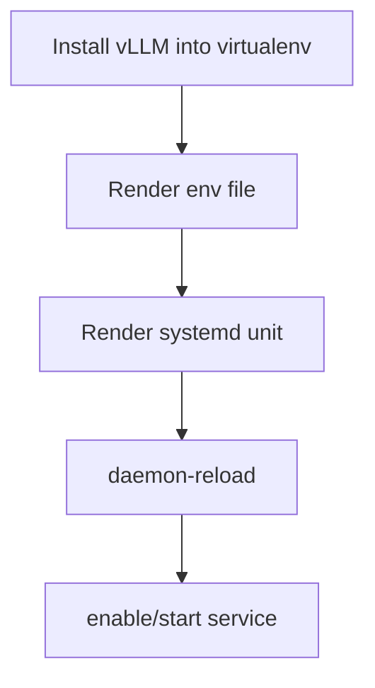

# Role: ct_runtime_vllm

## Purpose
Install/configure vLLM inside CT and manage it with systemd.

Supported CT distributions: Debian 12/13, Ubuntu 22.04/24.04 LTS, and RHEL/AlmaLinux/Rocky/Oracle Linux 9/10.

This role can consume shared values from `ct_runtime_launcher_common`, while runtime-specific variables (for example `ct_runtime_vllm_model`) continue to work as before.

## Usage
```yaml
- hosts: ct_targets
  become: true
  roles:
    - role: ktooi.pve_inference.ct_runtime_common
    - role: ktooi.pve_inference.ct_runtime_vllm
```

### Tuning example
```yaml
ct_runtime_vllm_model: "Qwen/Qwen3.5-27B"
ct_runtime_vllm_tensor_parallel_size: 4
ct_runtime_vllm_pipeline_parallel_size: 1
ct_runtime_vllm_gpu_memory_utilization: 0.88
ct_runtime_vllm_dtype: "auto"
ct_runtime_vllm_kv_cache_dtype: "auto"
ct_runtime_vllm_max_model_len: 262144
ct_runtime_vllm_max_num_seqs: 128
ct_runtime_vllm_max_num_batched_tokens: 8192
ct_runtime_vllm_tool_call_parser: "qwen3_coder"
ct_runtime_vllm_reasoning_parser: "qwen3"
ct_runtime_vllm_served_model_name: "qwen3.5"
ct_runtime_vllm_nccl_p2p_disable: 0
ct_runtime_vllm_nccl_ib_disable: 0
ct_runtime_vllm_nccl_p2p_level: 5
ct_runtime_vllm_nccl_debug: "INFO"
ct_runtime_vllm_nccl_ignore_disabled_p2p: 1
ct_runtime_vllm_ld_library_path: "/usr/local/nvidia/lib64:/usr/local/nvidia/lib:/usr/lib/x86_64-linux-gnu"
```

## Flow


## Variables

| Variable | Description | Default | Allowed values |
|---|---|---|---|
| `ct_runtime_vllm_user` | Service user | `infer` | Existing Linux username |
| `ct_runtime_vllm_group` | Service group | `infer` | Existing Linux group |
| `ct_runtime_vllm_venv` | venv path containing `vllm` | `/opt/inference/venv` | Absolute path |
| `ct_runtime_vllm_workdir` | systemd WorkingDirectory | `/opt/inference` | Absolute path |
| `ct_runtime_vllm_env_file` | Environment file path | `/etc/default/vllm` | Absolute path |
| `ct_runtime_vllm_service_name` | systemd service unit name | `vllm.service` | Valid unit name |
| `ct_runtime_vllm_systemd_log_to_files` | Write service stdout/stderr to files via systemd `append:` | `true` | `true` / `false` |
| `ct_runtime_vllm_stdout_log` | vLLM stdout log file path (when file logging enabled) | `/var/log/inference/vllm.stdout.log` | Absolute path |
| `ct_runtime_vllm_stderr_log` | vLLM stderr log file path (when file logging enabled) | `/var/log/inference/vllm.stderr.log` | Absolute path |
| `ct_runtime_vllm_systemd_restart` | systemd restart policy for vLLM service | `on-failure` | `no`, `on-failure`, `always`, ... |
| `ct_runtime_vllm_systemd_restart_sec` | Delay before restart attempts | `3` | Integer/seconds string |
| `ct_runtime_vllm_install_cuda_userspace` | Install CUDA userspace libs inside CT | `true` | `true` / `false` |
| `ct_runtime_vllm_cuda_packages` | CUDA userspace package list | distro-dependent | Package list |
| `ct_runtime_vllm_fail_on_cuda_package_install` | Fail when CUDA package install fails | `false` | `true` / `false` |
| `ct_runtime_vllm_require_libcuda` | Require `libcuda.so.1` preflight check (when `ct_runtime_vllm_device=cuda`) | `true` | `true` / `false` |
| `ct_runtime_vllm_require_nvidia_smi` | Require `nvidia-smi -L` preflight check (when `ct_runtime_vllm_device=cuda`) | `true` | `true` / `false` |
| `ct_runtime_vllm_fail_on_nvidia_smi_probe` | Fail when `nvidia-smi` preflight fails | `false` | `true` / `false` |
| `ct_runtime_vllm_require_torch_cuda_available` | Require torch CUDA preflight probe (when `ct_runtime_vllm_device=cuda`) | `true` | `true` / `false` |
| `ct_runtime_vllm_torch_cuda_probe_mode` | Torch CUDA readiness mode | `strict` | `strict` (requires `is_available`+`device_count`), `count` (requires only `device_count`) |
| `ct_runtime_vllm_libcuda_candidate_paths` | Extra file paths checked for `libcuda.so.1` in CT | see defaults | List of absolute paths |
| `ct_runtime_vllm_require_nvidia_device_nodes` | Require `/dev/nvidia*` in CT (when `ct_runtime_vllm_device=cuda`) | `true` | `true` / `false` |
| `ct_runtime_vllm_device` | vLLM device selection | `cuda` | `cuda`, `cpu`, runtime-supported values |
| `ct_runtime_vllm_force_device_arg` | Force `--device` CLI arg even for CUDA (off by default for CLI compatibility) | `false` | `true` / `false` |
| `ct_runtime_vllm_logging_level` | vLLM logging verbosity | `INFO` | `DEBUG`, `INFO`, `WARNING`, ... |
| `ct_runtime_vllm_bind_host` | API bind host | `0.0.0.0` | IP/host string |
| `ct_runtime_vllm_port` | API port | `8000` | Integer `1..65535` |
| `ct_runtime_vllm_model` | Model identifier | `mistralai/Mistral-7B-Instruct-v0.3` | Valid model identifier |
| `ct_runtime_vllm_served_model_name` | Candidate served model name value | `""` | Empty, string, or list (first non-empty string is used) |
| `ct_runtime_vllm_pass_served_model_name` | Pass `--served-model-name` to vLLM CLI | `false` | `true` / `false` |
| `ct_runtime_vllm_tensor_parallel_size` | Tensor parallel size | `1` | Integer `>=1` |
| `ct_runtime_vllm_pipeline_parallel_size` | Pipeline parallel size | `1` | Integer `>=1` |
| `ct_runtime_vllm_gpu_memory_utilization` | GPU memory utilization ratio | `0.9` | Float `0.1..1.0` |
| `ct_runtime_vllm_dtype` | Weights/compute dtype | `auto` | `auto`, `float16`, `bfloat16`, etc. |
| `ct_runtime_vllm_kv_cache_dtype` | KV cache dtype | `auto` | `auto`, `fp8`, etc. |
| `ct_runtime_vllm_max_model_len` | Max model context length | `8192` | Integer `>=1` |
| `ct_runtime_vllm_max_num_seqs` | Max concurrent sequences | `32` | Integer `>=1` |
| `ct_runtime_vllm_max_num_batched_tokens` | Max batched tokens | `4096` | Integer `>=1` |
| `ct_runtime_vllm_tool_call_parser` | Tool call parser backend | `""` | Empty or parser name |
| `ct_runtime_vllm_reasoning_parser` | Reasoning parser backend | `""` | Empty or parser name |
| `ct_runtime_vllm_nccl_p2p_disable` | NCCL P2P disable flag | `0` | `0` / `1` |
| `ct_runtime_vllm_nccl_ib_disable` | NCCL IB disable flag | `0` | `0` / `1` |
| `ct_runtime_vllm_nccl_p2p_level` | NCCL P2P level | `5` | Integer |
| `ct_runtime_vllm_nccl_debug` | NCCL debug level | `INFO` | `TRACE`, `INFO`, `WARN`, ... |
| `ct_runtime_vllm_nccl_ignore_disabled_p2p` | Ignore disabled P2P warning | `1` | `0` / `1` |
| `ct_runtime_vllm_omp_num_threads` | OMP thread count | `""` | Empty or integer string |
| `ct_runtime_vllm_ld_library_path` | Library search path | `/usr/local/nvidia/lib64:/usr/local/nvidia/lib:/usr/lib/x86_64-linux-gnu` | PATH-like string |
| `ct_runtime_vllm_hf_cache_dir` | Hugging Face cache dir | `""` | Empty or absolute path |
| `ct_runtime_vllm_extra_args` | Extra CLI args | `""` | String |
| `ct_runtime_vllm_version` | Pin version (optional) | `""` | Empty or semantic version string |
| `ct_runtime_vllm_torch_package` | Optional explicit torch package to install in venv before CUDA probe | `""` | Empty or pip requirement string (e.g. `torch==2.6.0`) |
| `ct_runtime_vllm_torch_extra_index_url` | Optional extra index URL used with `ct_runtime_vllm_torch_package` | `""` | Empty or URL |


> CUDA preflight note: by default this role validates `/dev/nvidia*`, `libcuda.so.1`, `nvidia-smi -L`, and torch CUDA visibility. `nvidia-smi` failures are warnings by default (`ct_runtime_vllm_fail_on_nvidia_smi_probe: false`) while torch preflight remains enforced. Torch `strict` mode requires both `torch.cuda.is_available()==True` and `device_count > 0`. Use `ct_runtime_vllm_torch_cuda_probe_mode: count` only if you intentionally want a relaxed check.

> Driver/torch alignment note: when host driver is older than the default torch CUDA build bundled via `vllm`, set `ct_runtime_vllm_torch_package` and `ct_runtime_vllm_torch_extra_index_url` to install a compatible torch wheel explicitly before preflight (for example CUDA 12.4 wheels for NVIDIA 550-series hosts). If you pin torch, also pin a compatible `ct_runtime_vllm_version`; mismatched torch/vLLM binary ABI can cause `undefined symbol` import errors in `vllm._C`.

> Logging note: some minimal CT environments do not persist journald entries. By default this role configures systemd to append vLLM stdout/stderr into `/var/log/inference/vllm.stdout.log` and `/var/log/inference/vllm.stderr.log` for troubleshooting restart loops.

> CLI compatibility note: older vLLM versions may reject `--device cuda`. This role omits `--device` for CUDA by default and only passes it for non-CUDA devices (or when `ct_runtime_vllm_force_device_arg=true`).

> Environment naming note: runtime command variables are exported with `INFER_VLLM_*` names (not `VLLM_*`) to avoid `Unknown vLLM environment variable` warnings emitted by newer vLLM versions.

> Restart-loop note: default policy is `on-failure` (not `always`) so normal exits do not loop forever. If you still see restarts, inspect `/var/log/inference/vllm.stderr.log` and kernel OOM logs (`dmesg -T | grep -i -E 'killed process|out of memory'`).

> Served-model-name note: if shared launcher vars accidentally provide a list (for example `['qwen3.5', None]`), this role normalizes it to the first non-empty string. Passing `--served-model-name` is disabled by default (`ct_runtime_vllm_pass_served_model_name=false`) because some vLLM versions reject/validate this path strictly.

> Extra-args note: `ct_runtime_vllm_extra_args` is appended only when non-empty, preventing empty trailing CLI arguments that can trigger `vllm: error: unrecognized arguments:` on some versions.
